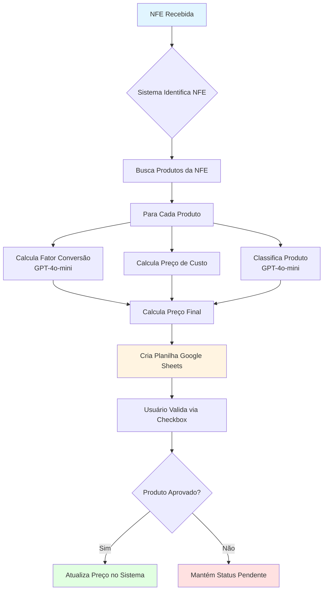
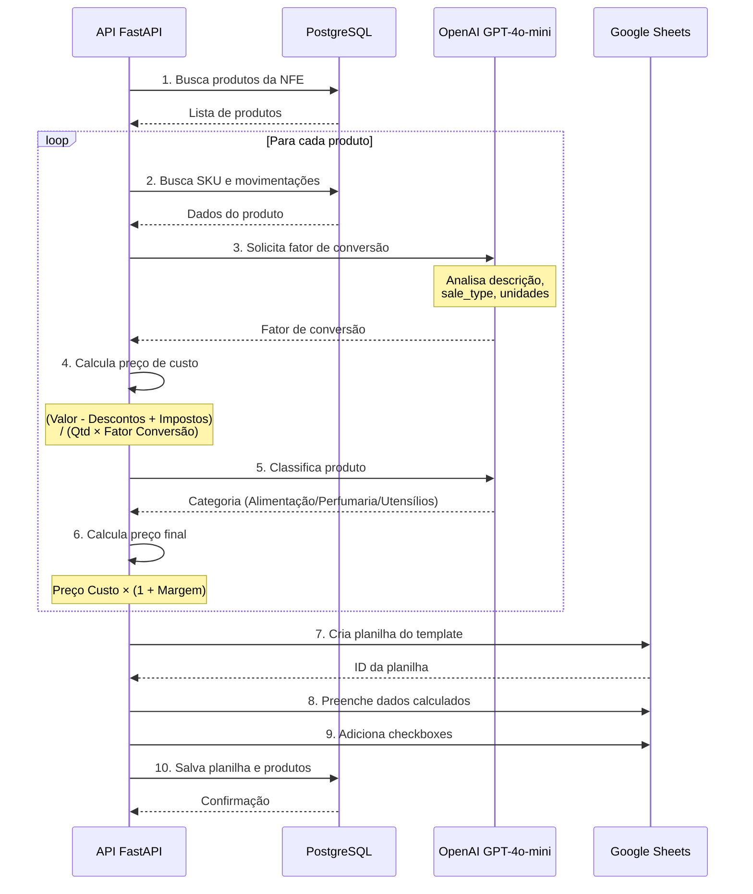
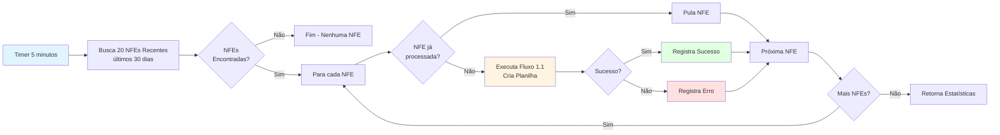
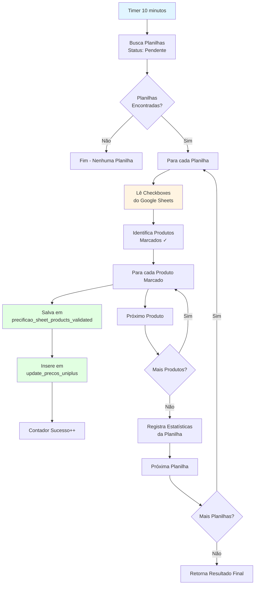
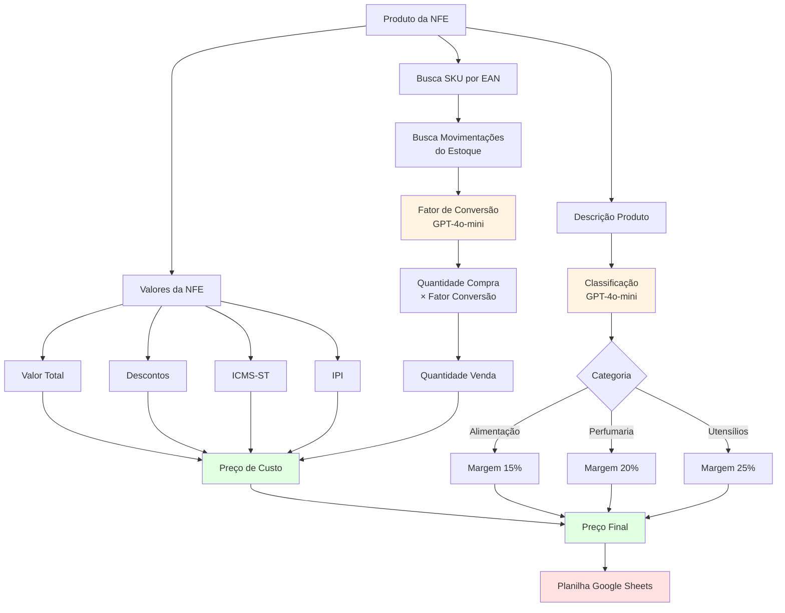
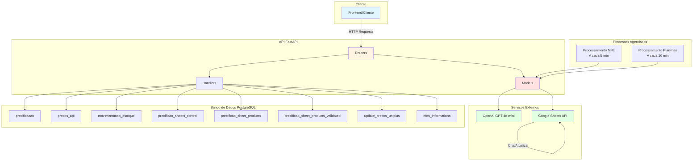
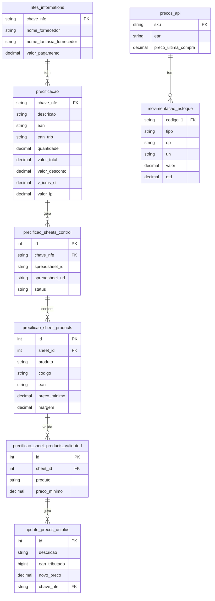
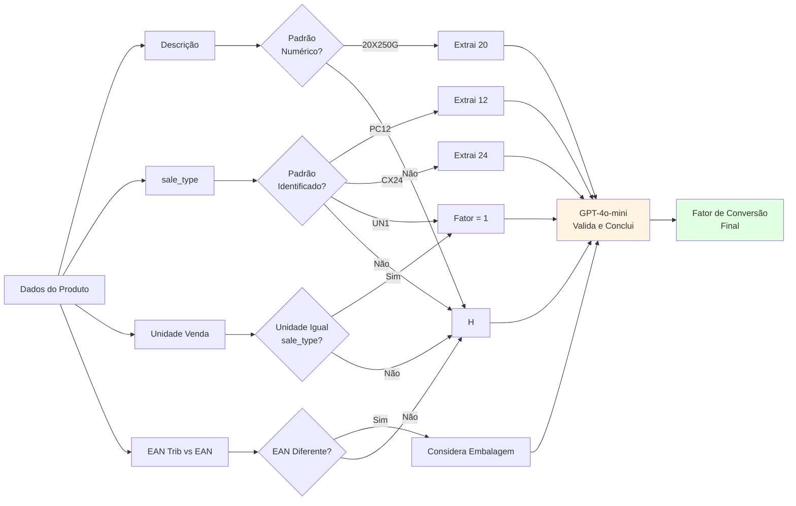
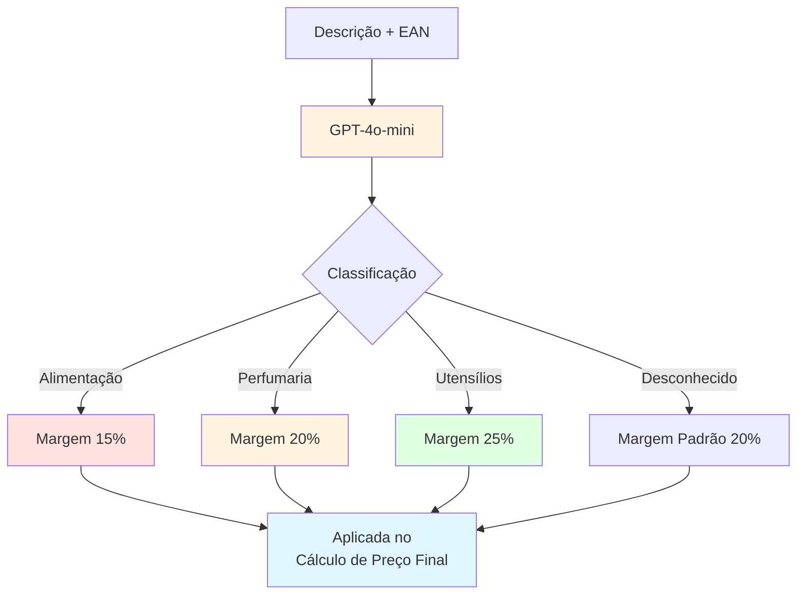

# Reviewer Cost Price - Sistema de Precificação Automatizado

## Problema de Negócio

Sistema automatizado para revisão e cálculo de precificação de produtos de supermercado a partir de Notas Fiscais Eletrônicas (NFEs). O sistema resolve os seguintes desafios:

1. **Cálculo Automatizado de Preços**: Processa produtos de NFEs e calcula preços de custo e preços finais sugeridos, considerando fatores de conversão entre unidades de compra e venda.

2. **Gestão de Unidades**: Resolve a complexidade de conversão entre unidades de compra (caixas, fardos, pacotes) e unidades de venda (unidades individuais), usando inteligência artificial para inferir fatores de conversão.

3. **Aplicação de Margens Diferenciadas**: Classifica produtos automaticamente em categorias (Alimentação, Perfumaria, Utensílios) para aplicar margens adequadas (15%, 20% e 25% respectivamente).

4. **Validação e Aprovação**: Fornece interface via Google Sheets para validação manual dos preços calculados antes da atualização no sistema de gestão.

5. **Automação de Processamento**: Processa automaticamente as NFEs mais recentes e cria planilhas para análise, além de verificar periodicamente planilhas pendentes para atualização.

## Fluxo do Processo

### Visão Geral do Sistema



### 1. Processamento de NFE

#### 1.1 Criação de Planilha a partir de NFE

```
Requisição → POST /sheets/create-sheet-from-nfe/{chave_nfe}
```

**Diagrama de Fluxo Detalhado:**



**Fluxo passo a passo:**
1. Recebe a chave da NFE
2. Busca produtos da NFE no banco de dados (`precificacao`)
3. Para cada produto:
   - **Fator de Conversão**: Usa GPT-4o-mini para determinar quantas unidades individuais existem na embalagem (ex: caixa com 20 unidades)
   - **Preço de Custo**: Calcula considerando:
     - Valor total da compra
     - Descontos aplicados
     - Impostos (ICMS-ST, IPI)
     - Quantidade convertida para unidade de venda
   - **Classificação**: Usa GPT-4o-mini para classificar o produto em Alimentação/Perfumaria/Utensílios
   - **Margem**: Aplica margem conforme categoria (15%/20%/25%)
   - **Preço Final Sugerido**: Calcula preço mínimo com margem aplicada
4. Cria planilha no Google Sheets a partir de template
5. Preenche planilha com dados calculados
6. Adiciona coluna de checkboxes para validação
7. Compartilha planilha com usuários
8. Salva informações no banco de dados:
   - `precificao_sheets_control` (controle da planilha)
   - `precificao_sheet_products` (produtos da planilha)

### 2. Processamento Agendado de NFEs

**Frequência**: A cada 5 minutos (300 segundos)

**Diagrama de Fluxo:**



**Fluxo:**
1. Busca as 20 NFEs mais recentes dos últimos 30 dias que ainda não foram processadas
2. Para cada NFE, cria automaticamente uma planilha (mesmo fluxo do item 1.1)
3. Registra resultados (sucesso/erro)

### 3. Processamento de Planilhas Pendentes

**Frequência**: A cada 10 minutos (600 segundos)

**Diagrama de Fluxo:**



**Fluxo:**
1. Busca todas as planilhas com status "pendente"
2. Para cada planilha:
   - Lê status dos checkboxes da planilha no Google Sheets
   - Identifica produtos marcados para aprovação
   - Salva produtos validados em `precificao_sheet_products_validated`
   - Insere produtos aprovados na tabela `update_precos_uniplus` para atualização no sistema de gestão
3. Planilha permanece disponível para referência futura

### 4. Fluxo de Cálculo de Preço por Produto

**Diagrama Detalhado do Cálculo:**



**Fórmulas:**
- **Preço de Custo** = (Valor Total - Descontos + ICMS-ST + IPI) / (Quantidade Compra × Fator Conversão)
- **Preço Final** = Preço de Custo × (1 + Margem)
- **Quantidade Venda** = Quantidade Compra × Fator de Conversão

### 5. Endpoints Individuais

#### Cálculo de Preço de Custo
```
GET /api/cost-price/{ean}/{chave_nfe}
```
Retorna preço de custo calculado para um produto específico.

#### Cálculo de Preço Final
```
GET /api/final-price/{ean}/{chave_nfe}/{descricao}
```
Retorna preço final sugerido com margem aplicada.

#### Classificação e Margem
```
GET /api/margin/{ean}/{descricao}
```
Retorna classificação do produto e margem aplicável.

#### Estimativa de Quantidade
```
GET /quantity/quantity-estimate/{ean}/{chave_nfe}
```
Retorna fator de conversão e quantidade convertida.

#### Detalhes de NFE
```
GET /api/nfe-final-price/{chave_nfe}
```
Retorna todos os produtos de uma NFE com cálculos completos.

## Arquitetura do Sistema

**Diagrama de Arquitetura:**



## Componentes Detalhados

### Handlers
- **`db_connection.py`**: Gerencia pool de conexões PostgreSQL com retry automático
- **`llm_handler.py`**: Trata respostas JSON do OpenAI (limpeza e parsing)

### Models (Lógica de Negócio)

#### Cálculos
- **`conversion_factor_calculator.py`**: Usa GPT-4o-mini para inferir fator de conversão entre unidades
- **`cost_price_calculator.py`**: Calcula preço de custo por unidade de venda
- **`final_price_calculator.py`**: Calcula preço final com margem aplicada
- **`margin_calculator.py`**: Usa GPT-4o-mini para classificar produtos e determinar margem

#### Integrações
- **`google_sheets_service.py`**: Gerencia criação, edição e leitura de planilhas Google Sheets
- **`nfe_price_service.py`**: Orquestra cálculo completo de preços para todos os produtos de uma NFE

#### Processamento
- **`sheets_creator_service.py`**: Processa NFEs pendentes e cria planilhas
- **`sheets_processing_service.py`**: Processa planilhas pendentes e atualiza preços aprovados

### Routers (Endpoints API)
- **`cost_price_router.py`**: Endpoint para cálculo de preço de custo
- **`final_price_router.py`**: Endpoint para cálculo de preço final
- **`margin_router.py`**: Endpoint para classificação e margem
- **`nfe_price_router.py`**: Endpoint para detalhes completos de NFE
- **`quantity_estimator.py`**: Endpoint para estimativa de quantidade
- **`sheets_route.py`**: Endpoints para criação e processamento de planilhas

## Tecnologias Utilizadas

### Backend
- **FastAPI 0.115.11**: Framework web para construção da API REST
- **Python 3.x**: Linguagem de programação

### Banco de Dados
- **PostgreSQL**: Banco de dados relacional
- **psycopg2 2.9.10**: Driver PostgreSQL para Python
- **Connection Pooling**: Pool de conexões para otimização

### Integrações Externas
- **Google Sheets API (google-api-python-client 2.160.0)**: Integração com Google Sheets
  - Criação de planilhas a partir de templates
  - Leitura e escrita de dados
  - Gerenciamento de permissões
- **OpenAI API (openai 1.65.2)**: Uso de modelos GPT-4o-mini
  - Inferência de fatores de conversão
  - Classificação de produtos

### Servidor
- **Uvicorn 0.34.0**: ASGI server para desenvolvimento
- **Gunicorn 20.1.0**: WSGI server para produção
- **AsyncIO**: Processamento assíncrono para tarefas agendadas

### Outras Bibliotecas
- **Pydantic 2.10.6**: Validação de dados e modelos
- **python-dotenv 1.0.1**: Gerenciamento de variáveis de ambiente
- **NumPy 2.2.3**: Operações matemáticas (usado indiretamente)
- **oauth2client 3.0.0**: Autenticação OAuth2 para Google APIs

## Estrutura de Dados

**Diagrama de Relacionamento entre Tabelas:**



### Tabelas Principais

#### `precificacao`
Armazena dados de produtos das NFEs:
- `chave_nfe`, `descricao`, `ean`, `ean_trib`
- `quantidade`, `valor_total`, `valor_desconto`
- `v_icms_st`, `valor_ipi`, `quantidade_tributada`, `unidade_tributada`

#### `precos_api`
Armazena informações de produtos:
- `sku`, `ean`, `preco_ultima_compra`

#### `movimentacao_estoque`
Histórico de movimentações:
- `codigo_1` (SKU), `tipo`, `op`, `un`, `valor`, `qtd`

#### `precificao_sheets_control`
Controle de planilhas criadas:
- `chave_nfe`, `spreadsheet_id`, `spreadsheet_url`, `status`

#### `precificao_sheet_products`
Produtos de cada planilha:
- Dados completos do produto com cálculos

#### `precificao_sheet_products_validated`
Produtos validados pelos usuários:
- Mesmos campos de `precificao_sheet_products`

#### `update_precos_uniplus`
Produtos aprovados para atualização:
- `descricao`, `ean_tributado`, `novo_preco`, `chave_nfe`

#### `nfes_informations`
Informações das NFEs:
- `chave_nfe`, `nome_fornecedor`, `nome_fantasia_fornecedor`, `valor_pagamento`

## Lógica de Negócio Específica

### Cálculo de Preço de Custo
```
Custo por Unidade = (Valor Total - Descontos + ICMS-ST + IPI) / (Quantidade Compra × Fator de Conversão)
```

### Cálculo de Preço Final
```
Preço Final = Preço de Custo × (1 + Margem)
```

### Fator de Conversão

**Fluxo de Inferência do Fator de Conversão:**



Determinado por GPT-4o-mini considerando:
- Descrição do produto (ex: "20X250G" → 20 unidades)
- Tipo de venda na NFE (ex: "PC12" → 12 unidades)
- Unidade de venda mais frequente no estoque
- Relação entre EAN tributário e EAN comercial

### Classificação de Produtos

**Fluxo de Classificação:**



GPT-4o-mini classifica em:
- **Alimentação**: Margem de 15%
- **Perfumaria**: Margem de 20%
- **Utensílios**: Margem de 25%

## Execução

```bash
# Instalação de dependências
pip install -r requirements.txt

# Configuração de variáveis de ambiente (.env)
DB_HOST=...
DB_PORT=...
DB_NAME=...
DB_USER=...
DB_PASSWORD=...
OPENAI_KEY=...
GOOGLE_CREDENTIALS={...}  # JSON string com credenciais do Google Service Account

# Execução
python main.py
# ou
uvicorn main:app --host 0.0.0.0 --port 8000
```

## Processamento Automático

**Visão Geral dos Processos Agendados:**

```mermaid
gantt
    title Processos Agendados do Sistema
    dateFormat HH:mm
    axisFormat %H:%M
    
    section Processamento NFE
    Execução (5 min) :active, nfe1, 00:00, 00:05
    Pausa (5 min)     :nfe2, 00:05, 00:10
    Execução (5 min)  :nfe3, 00:10, 00:15
    
    section Processamento Planilhas
    Execução (10 min) :active, sheet1, 00:00, 00:10
    Pausa (10 min)    :sheet2, 00:10, 00:20
    Execução (10 min) :sheet3, 00:20, 00:30
```



**Timeline dos Processos:**

```mermaid
timeline
    title Ciclo de Processamento
    
    00:00 : Processamento NFE
           : Processamento Planilhas
    
    00:05 : Processamento NFE
    
    00:10 : Processamento NFE
           : Processamento Planilhas
    
    00:15 : Processamento NFE
    
    00:20 : Processamento NFE
           : Processamento Planilhas
```

O sistema executa automaticamente dois processos em background:

1. **Processamento de NFEs**: A cada 5 minutos, cria planilhas para as 20 NFEs mais recentes não processadas
2. **Processamento de Planilhas**: A cada 10 minutos, processa planilhas pendentes e atualiza preços aprovados

## Observações Importantes

- O sistema utiliza locks para evitar execuções simultâneas dos processamentos agendados
- Planilhas são criadas a partir de um template predefinido no Google Sheets
- Checkboxes são adicionados automaticamente na coluna O para validação manual
- Produtos só são atualizados após validação manual via checkbox na planilha
- O sistema mantém histórico completo de todas as planilhas e validações